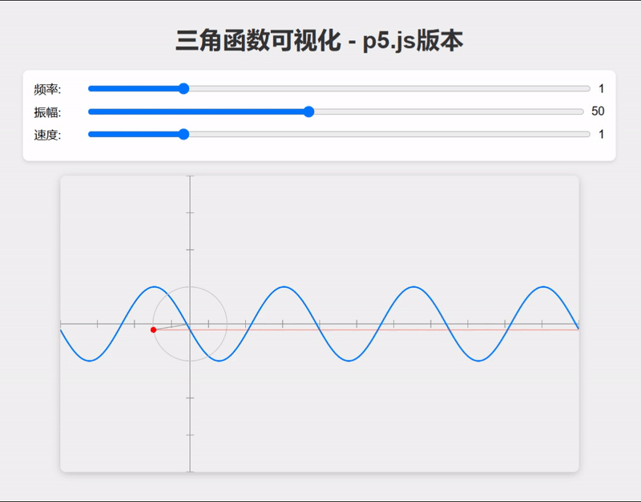
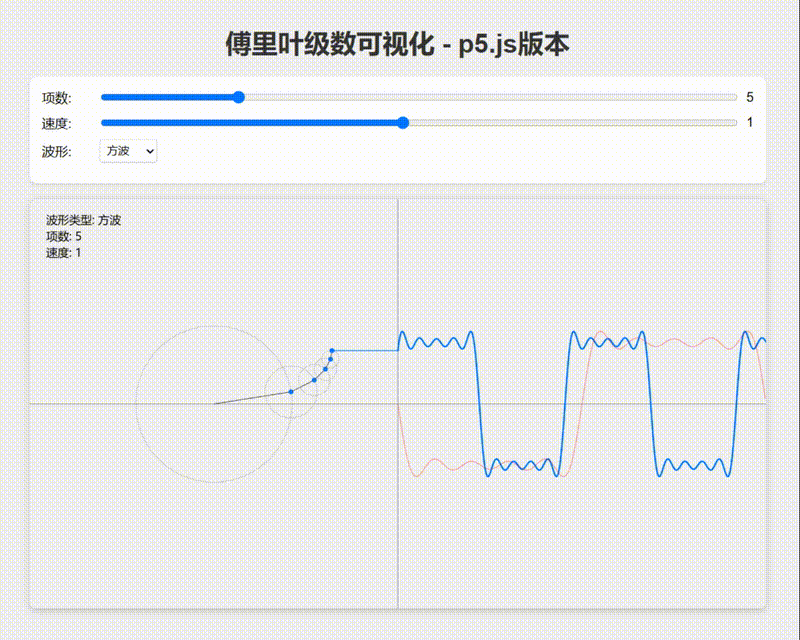

# Intro
**"Coding Druid"** series is my **horizontal programming** practice notes, each part around a topic (mathematical physics electronic graphics sound...), implemented in several programming languages.

# Articles:

- English:
    - https://www.avantcontra.com/category/codingdruid/
    - https://medium.com/@contra

- 中文版/Chinese:
    - 微信公众号/知乎专栏：[实验编程](https://zhuanlan.zhihu.com/floatlab)

# Source code

## 01-Math-Trig-Function
Trigonometric function (Sine) visualization. 

**Click the text link** to see each language implemented.

- [MaxMSP](https://github.com/avantcontra/coding-druid/tree/master/01-Math-Trig-Function/maxmsp)

    

- [JavaScript/React](https://github.com/avantcontra/coding-druid/tree/master/01-Math-Trig-Function/sine-js-react)

    
     Forked one, refactoring using React Hooks

- [JavaScript/p5.js](https://github.com/avantcontra/coding-druid/tree/master/01-Math-Trig-Function/sine-p5js)

    
    Sine Function Visualization Using p5.js.

- [Python](https://github.com/avantcontra/coding-druid/tree/master/01-Math-Trig-Function/sine-python)

    

- [Unity3D](https://github.com/avantcontra/coding-druid/tree/master/01-Math-Trig-Function/sine-unity)

    
    
## 02-Math-Fourier-Series
Fourier Series visualization.
- [JavaScript/React](https://github.com/avantcontra/coding-druid/tree/master/02-Math-Fourier-Series/fourier-series-js-react)

    
    Fourier Series Visualization Using SVG and React Hooks.
    
- [JavaScript/p5.js](https://github.com/avantcontra/coding-druid/tree/master/02-Math-Fourier-Series/fourier-series-p5js)

    
    Fourier Series Visualization Using p5.js.
    
- [Unity](https://github.com/avantcontra/coding-druid/tree/master/02-Math-Fourier-Series/fourier-series-unity)

    
    Fourier Series Visualization Using Unity.
    
- [Blender + Python](https://github.com/avantcontra/coding-druid/tree/master/02-Math-Fourier-Series/fourier-series-python-blender)
 
    
    Fourier Series Visualization Using Blender + Python.
  
----

Cheers~

Contra

- patreon (**buy me a coffee** XD): [avantcontra](https://www.patreon.com/avantcontra)
- website: [avantcontra.com](https://www.avantcontra.com)
- instagram: [avantcontra](https://instagram.com/avantcontra)
- twitter: [avantcontra](https://twitter.com/avantcontra)
- 公/知/小/抖/B：[实验编程](https://space.bilibili.com/309452713)

